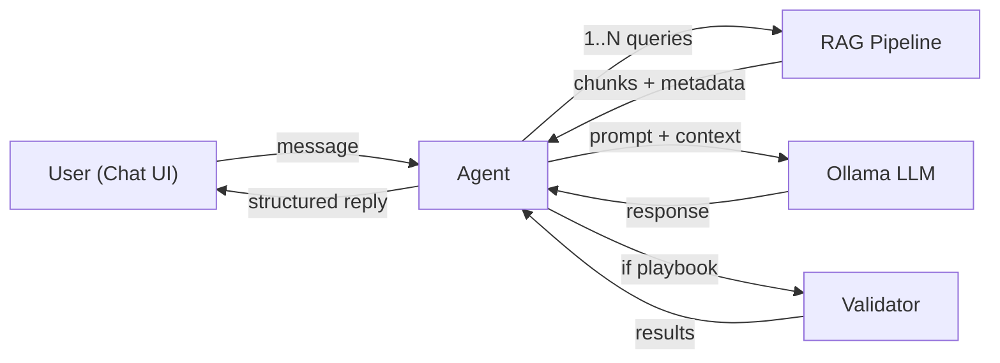

# Agent + Chat Layout Redesign

## Architecture Overview



**Current flow:** User -> picks mode -> one-shot generation -> result

**New flow:** User sends a chat message -> Agent analyzes intent -> Agent calls RAG as many times as needed -> Agent synthesizes a concise response -> chat message with optional playbook + validation

---

## 1. Database: New Chat Models

Add to [`models.py`](models.py):

- **`ChatThread`** -- represents a conversation (id, title auto-generated from first message, created_at, updated_at)
- **`ChatMessage`** -- each message in a thread (id, thread_id FK, role `user`/`assistant`, content text, optional playbook YAML, optional validation JSON, optional module_ref JSON, optional rag_meta JSON, created_at)
- **Keep `Generation` model** -- still populated when the agent generates a playbook, so that the Stats dashboard continues to work unchanged

---

## 2. Agent Module (new `agent/` package)

Create a new `agent/` package with three files:

### `agent/prompts.py` -- System prompts
- Agent system prompt defining its role: Ansible infrastructure assistant that can generate playbooks, explain modules, troubleshoot YAML, compare approaches, and edit previous playbooks
- Instructions for the agent to output a structured JSON "plan" of what RAG queries it needs before answering

### `agent/tools.py` -- RAG tools the agent can call
Wrap existing RAG functions as discrete tools:
- `search_docs(query, collection?)` -- calls `retriever.get_retrieval_metadata()` and returns relevant chunks
- `generate_playbook(user_request, rag_context)` -- calls `rag/generator.py generate()` to produce YAML
- `validate_yaml(filepath)` -- calls `validator.validate_playbook()`
- `get_module_info(module_name)` -- calls `build_module_reference()` from `app.py`

### `agent/orchestrator.py` -- Main agent logic
Two-phase approach (most reliable with Ollama models):

1. **Phase 1 -- Plan:** Send conversation history + new user message to LLM with a planning prompt. LLM returns structured JSON indicating what it needs (e.g., `{"actions": [{"tool": "search_docs", "query": "helm deploy"}, {"tool": "search_docs", "query": "helm required params"}]}`).
2. **Execute:** Run the planned RAG/tool calls, collect results.
3. **Phase 2 -- Synthesize:** Send gathered context + conversation history back to LLM to produce the final user-facing response. If a playbook was requested, the response includes generated YAML + validation results.

Key function:

```python
def handle_message(thread_id: int, user_message: str, history: list[dict]) -> AgentResponse:
    # 1. Plan: ask LLM what info is needed
    # 2. Execute: run RAG queries / tools
    # 3. Synthesize: produce final response
    # Returns: AgentResponse(text, playbook?, validation?, module_ref?, rag_meta?)
```

Uses the same Ollama model already configured (`qwen2.5-coder:7b` via `OLLAMA_MODEL` env var).

---

## 3. API: New Chat Endpoints in [`app.py`](app.py)

New routes:
- `POST /api/chat` -- accepts `{thread_id?, message}`, creates thread if needed, calls agent, saves messages, returns agent response
- `GET /api/threads` -- list threads (newest first)
- `GET /api/threads/<id>` -- get thread with all messages
- `DELETE /api/threads/<id>` -- delete thread and its messages
- `PATCH /api/threads/<id>` -- rename a thread

Keep unchanged:
- `/stats` -- still queries `Generation` table
- `/docs/*` -- all docs management routes untouched
- `/rag/status` -- still used to check if RAG is available
- `/module/<slug>` -- still used for module info

Remove:
- `/generate` -- replaced by `/api/chat`
- `/history`, `/history/<id>` -- replaced by threads

---

## 4. Frontend: Chat Layout

Redesign [`templates/index.html`](templates/index.html) and [`static/js/app.js`](static/js/app.js):

```
+--------------------------------------------------+
| Sidebar    |  Chat Area              | Right Panel|
|            |                         |            |
| [+ New]    |  Agent: Welcome msg     | [Stats]    |
|            |                         | [Docs Mgmt]|
| Thread 1   |  User: deploy redis...  |            |
| Thread 2 * |                         |            |
| Thread 3   |  Agent: Here's your     |            |
|            |  playbook: [YAML block] |            |
|            |  Validation: passed     |            |
|            |  Source: redis module    |            |
|            |                         |            |
|            |  [input box] [Send]     |            |
+--------------------------------------------------+
```

- **Left sidebar:** Thread list with "New Chat" button, search/filter, delete
- **Center:** Chat message feed. Messages can contain:
  - Plain text (explanations, troubleshooting)
  - Playbook code block with copy button
  - Inline validation badge (passed/warnings/errors)
  - Collapsible module source reference
- **Right panel (collapsible):** Stats dashboard and Docs Management panels (same as today, just moved to the side)
- **Bottom input:** Text input + Send button + Ctrl+Enter shortcut
- **Loading state:** Show a "thinking" indicator on the agent's message bubble while waiting for the complete response

---

## 5. Integration Details

- When the agent generates a playbook, also insert a `Generation` row so stats remain accurate
- Thread titles are auto-generated from the first user message (truncated to ~50 chars)
- Conversation history is sent to the agent (last N messages) for multi-turn context
- The agent can reference previous playbooks in the thread when the user says "now add persistence" or "change the namespace"
- Existing suggestion chips can become a welcome message with clickable examples in the first empty chat
