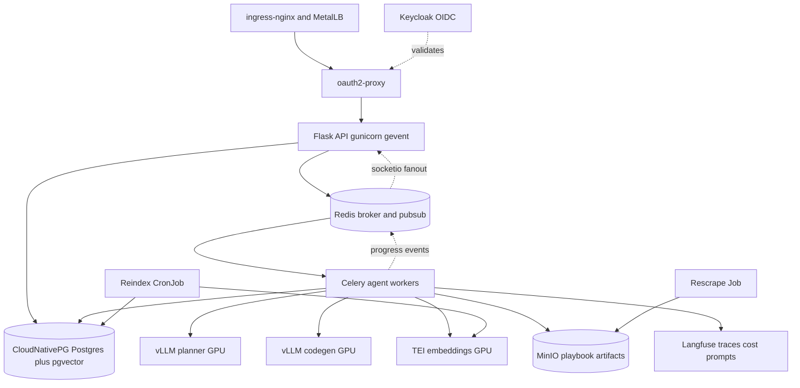

# AnsibleAI Production Deployment Plan

On-prem Kubernetes, self-hosted GPU inference, OIDC SSO, external vector store.

## Target architecture

## Tool selection

- Cluster and delivery: RKE2/k3s, ArgoCD (GitOps), Argo Rollouts (canary), Helm chart in `deploy/helm/ansibleai` with staging/prod values
- Data: CloudNativePG (Postgres 16 + pgvector) replaces MySQL and ChromaDB, Redis for broker/pubsub/locks, MinIO for generated playbooks and scraped docs
- Inference: NVIDIA GPU Operator, vLLM (planner + codegen), HuggingFace TEI (embeddings), KEDA autoscaling on `vllm:num_requests_waiting` and Celery queue depth
- Identity: Flask-Login with argon2id hashing and Redis-backed server-side sessions in Phase 0, migrating to Keycloak + oauth2-proxy with in-app JWT verification in Phase 5
- LLMOps: Langfuse (self-hosted) for tracing, token/cost accounting, and prompt versioning
- Observability: kube-prometheus-stack, Loki, Tempo, OTel Collector, DCGM GPU metrics
- Supply chain: Harbor registry, Trivy, Syft SBOM, Cosign signing, Kyverno admission, External Secrets Operator + Vault

Consolidating on Postgres+pgvector rather than Qdrant is deliberate: the index is only 8,065 chunks (`reports/indexing_report.json`), so a dedicated vector DB adds an operator without benefit, and CloudNativePG gives backups plus PITR for app data and vectors together.

## Phase 0 — Hygiene, config, and user management (prerequisite)

**Status: complete.** Verified against the live MySQL database (183 existing
threads, 416 messages, all preserved and reassigned to the seeded admin) with
`ruff` and `mypy` clean, 114 tests passing, and `scripts/smoke_auth.py`
passing all 24 checks end to end against a running server.

What landed, and where it deviates from the plan above:

| Area | Delivered | Deviation |
| --- | --- | --- |
| Config | `config.py`, pydantic-settings, fail-fast on missing `SECRET_KEY`/`DATABASE_URL` | — |
| Logging | `logging_setup.py`, structlog, request IDs, `print()` removed from app + agent | — |
| Probes | `/healthz`, `/readyz` (DB, migration state, RAG), boot refuses un-migrated schema | — |
| Migrations | Alembic, guarded baseline + user-management revision | `db.create_all()` removed |
| Identity | `User` + `AuditEvent`, argon2id, Flask-Login, `chat_threads.user_id` backfilled | — |
| Sessions | Server-side via Flask-Session, SQLAlchemy backend | Redis backend is wired but unused until the Phase 1 compose stack exists |
| Endpoints | register / login / logout / me / password-change / csrf | — |
| Authorization | Default-deny `before_request`, per-user thread scoping, 404 not 403 | `DELETE /api/threads` is **not** admin-gated: it only deletes the caller's own threads, so it is a normal user action |
| Hardening | CSRF double-submit, Flask-Limiter, Talisman CSP + headers, session rotation, lockout, uniform login errors | `__Host-` cookie prefix deferred to Phase 1: it requires `Secure`, which breaks plain-HTTP local development |
| Tooling | ruff, mypy, pre-commit, ESLint 10 (flat config) + `tsc` hook | Legacy `pipeline/`, `rag/`, `agent/` errors are silenced per module rather than fixed, so the gate gets stricter as they are cleaned |

Deliberately **not** done in Phase 0:

- **Git history rewrite.** Large artifacts are now untracked and ignored, but they remain in history. Rewriting is a force-push that invalidates every clone, so it is a scheduled operation, not a side effect of this work.
- **Pydantic request-body validation everywhere.** The auth endpoints validate strictly; the rest still use ad-hoc key checks. Rolling this out touches every route and is better done alongside the Phase 2 async refactor, which rewrites those signatures anyway.
- **Email verification.** The `email_verified_at` column exists and is unused; Phase 5 delegates verification to Keycloak, so building an SMTP flow now would be thrown away.

Operational notes for a fresh environment: `alembic upgrade head`, then
`python scripts/seed_admin.py` (reads `BOOTSTRAP_ADMIN_EMAIL` /
`BOOTSTRAP_ADMIN_PASSWORD`, and enforces the password policy — a weak
bootstrap password is rejected rather than silently accepted), then
`python scripts/smoke_auth.py` as the post-deploy gate.

### 0a. Code hygiene and config

- Remove leftover debug instrumentation writing to `debug-2eb4cd.log` in [agent/graph.py](agent/graph.py) and [agent/orchestrator.py](agent/orchestrator.py)
- Purge `data/chromadb/` and the ~180 committed files in `output/` from git history, add to `.gitignore`
- Replace `print()` with `structlog` JSON logging; add request/trace ID propagation
- Centralize config in `config.py` using `pydantic-settings`; fail fast on missing required vars
- Add `/healthz` (liveness), `/readyz` (DB + Redis + vector store + inference reachability), and a startup probe for KB load and graph compile
- Introduce Alembic; replace `db.create_all()` at [app.py:184](app.py) with a migration Job
- Add ruff, mypy, pre-commit; add ESLint to the frontend

### 0b. User management

The app has no notion of a user today: every route in [app.py](app.py) is open, and [models.py](models.py) has no owner column on `chat_threads`, so any visitor can read and delete every conversation. That has to be fixed before the app is reachable by more than one person, which is why it belongs here and not in Phase 5.

The identity backend is kept pluggable so Phase 5 swaps the credential source rather than rewriting authentication. Concretely: the `User` model, session layer, and authorization checks stay put, and only the login path changes.

- Data model: `User` with `email` (unique, indexed), `password_hash`, `display_name`, `role`, `is_active`, `email_verified_at`, `last_login_at`, timestamps. Add nullable `provider` and `external_id` columns now so the Phase 5 OIDC account link needs no second migration
- Ownership: `chat_threads.user_id` as an indexed non-null FK. The Alembic migration seeds an initial admin from env vars and backfills existing threads to it
- Password hashing: argon2id via `argon2-cffi`, minimum 12 characters, screened against a breach list. Avoid bcrypt, whose 72-byte truncation is a footgun
- Sessions: Flask-Login with server-side sessions in Redis via Flask-Session. Redis moves into the Phase 0 compose stack since Phase 2 needs it anyway. Server-side storage is what makes logout real and lets a password change revoke every other session
- Endpoints: `POST /api/auth/register`, `/api/auth/login`, `/api/auth/logout`, `/api/auth/password/change`, and `GET /api/auth/me`. Registration is restricted to an allowlisted email domain and gated on an admin approval flag rather than being open signup — this is an internal tool that spends GPU time per request
- Frontend: login and register pages, an auth context provider, a protected-route wrapper around the chat shell, logout in the topbar, and a 401 interceptor in [frontend/src/lib/api.ts](frontend/src/lib/api.ts) that redirects to login. Socket.IO connects only after a session exists

### 0c. Application security baseline

- Authorization: `@login_required` on every API route. Every thread query filtered by the current user, returning 404 rather than 403 for another user's thread so IDs cannot be enumerated
- Admin role gate on the endpoints that mutate the shared knowledge base: `POST /docs/rescrape`, `POST /docs/check-updates`, and `POST /docs/rollback/restore`. `DELETE /api/threads` is left to regular users because per-user scoping already limits it to the caller's own conversations
- Cookies: `HttpOnly`, `Secure`, `SameSite=Lax`, `__Host-` prefix, session ID rotated on login to block session fixation, plus idle and absolute timeouts
- CSRF protection on state-changing requests via Flask-WTF, since the SPA authenticates with a cookie
- Brute-force defense: Flask-Limiter backed by Redis, throttling per IP and per account with progressive lockout. Verify a dummy hash on unknown emails so response timing does not leak whether an account exists, and return one generic "invalid email or password" for both failure modes
- Security headers via Flask-Talisman: HSTS, CSP, Referrer-Policy, `frame-ancestors`, Permissions-Policy
- `SECRET_KEY` read from the environment with no fallback default; startup fails without it
- Audit log table recording login success and failure, logout, password and role changes, and every admin action with IP and user agent
- Pydantic validation on all request bodies, replacing the current ad-hoc key checks

## Phase 1 — Containerize

- Multi-stage `Dockerfile.api`: node build of `frontend/` into `static/dist`, then Python slim runtime with gunicorn + gevent websocket worker
- `Dockerfile.worker`: same base plus `ansible-core` and `ansible-lint` (currently invoked as a subprocess but absent from `requirements.txt`), with `ANSIBLE_LINT_MODE=native`
- Non-root user, read-only root filesystem, tmpfs for the lint workdir, dropped capabilities
- Replace the dev server at [app.py:1108](app.py) (`debug=True`, `allow_unsafe_werkzeug=True`, `127.0.0.1`) with gunicorn bound to `0.0.0.0`
- `docker-compose.yml` for local parity: Postgres+pgvector, Redis, MinIO, Keycloak, vLLM (or Ollama fallback on dev machines)

**Status: artifacts complete, image build unverified.** Docker is not
installed on the development machine (absent from both Windows and WSL),
so nothing below has been through `docker build`. Everything that can be
checked without a daemon has been: `ruff` and `mypy` clean, 161 tests
passing including 17 new ones in
[tests/test_container_config.py](tests/test_container_config.py) that
assert the container invariants directly.

What landed, and where it deviates from the plan above:

| Area | Delivered | Deviation |
| --- | --- | --- |
| Image | One [Dockerfile](Dockerfile), three stages: `node:20-alpine` SPA build, `python:3.12-slim` dependency venv, slim runtime | **One image, not `Dockerfile.api` + `Dockerfile.worker`** — see below |
| Roles | [docker/entrypoint.sh](docker/entrypoint.sh) dispatches `api` / `migrate` / `smoke` / `exec`, with `worker` reserved for Phase 2 | Migrations moved out of the API path into a one-shot role so replicas cannot race Alembic |
| Server | [gunicorn.conf.py](gunicorn.conf.py), bound `0.0.0.0`, `workers=1`, `timeout=600`, `preload_app=False` | **`-k gevent`, not `GeventWebSocketWorker`** — see below |
| Lint toolchain | `ansible-core` and `ansible-lint` added to `requirements.txt` behind `sys_platform != "win32"`, `ANSIBLE_LINT_MODE=native` in the image | Environment marker rather than a separate file, so Windows `pip install -r` keeps working and keeps using the WSL hop |
| Hardening | Non-root uid 10001, `read_only: true`, `cap_drop: ALL`, `no-new-privileges`, tmpfs for `/tmp` and `HOME` | — |
| Config | `SOCKETIO_ASYNC_MODE` added to `config.py`; `app.py` no longer hardcodes `async_mode="threading"` | New setting: the worker class and Socket.IO have to agree, and a mismatch hangs rather than errors |
| Compose | MySQL 8.4 + Redis 7 + one-shot `migrate` + `api` | **MySQL, not Postgres+pgvector; no MinIO or Keycloak** — see below |
| Build context | [.dockerignore](.dockerignore) excludes `.env`, the 73 MB vector index, the 88 MB scrape cache and `node_modules`; `.gitattributes` pins LF on `docker/**` | — |

Three deliberate departures:

- **One image instead of two.** `Dockerfile.worker` was specified for the
  ansible-lint toolchain, but generation still runs inline inside
  `POST /api/chat`, so the API needs that toolchain too and the two images
  would be byte-identical. One image means one build, one Trivy scan and
  one SBOM in Phase 7. Phase 2 adds a `worker` service on the same tag
  with `command: ["worker"]` and no Dockerfile change.
- **`-k gevent`, not the `GeventWebSocketWorker` the plan named.** That
  worker comes from `gevent-websocket`, unmaintained since 2017. Current
  `python-engineio` serves WebSocket through `simple-websocket` instead,
  and having `gevent-websocket` installed alongside it makes the server
  close every connection immediately after the 101 handshake
  (miguelgrinberg/flask-socketio#2122) — a failure that reads as a network
  fault. A test asserts it stays out of `requirements.txt`.
- **Compose mirrors what the code talks to today.** Postgres+pgvector,
  MinIO and Keycloak belong to Phases 3, 2 and 5; the application cannot
  address any of them yet, so shipping them now would only slow the stack
  down and misrepresent what is wired up. Redis *is* included, because
  Phase 0 already built the session and rate-limit backends against it and
  had nothing to point them at. Ollama stays on the host to keep direct
  GPU access; Phase 4 replaces it with vLLM.

Still open after this phase:

- **No `docker build` has run.** Install Docker Desktop, then
  `docker compose --env-file .env.docker up --build`. The three pins most
  likely to need adjustment are `gevent==24.11.1`, `ansible-core==2.18.1`
  and `ansible-lint==24.12.2`.
- **`__Host-` cookie prefix, still deferred.** It requires `Secure`, which
  requires TLS. The compose stack publishes plain HTTP, which is also why
  `.env.docker.example` sets `APP_ENV=development`. Both resolve when TLS
  terminates at the ingress.
- **No image scanning, signing or registry push.** Trivy, Syft and Cosign
  are Phase 7, which is where a CI pipeline exists to run them.
- **No dependency lockfile.** `requirements.txt` pins direct dependencies
  exactly but transitives float, so two builds a month apart can differ.
  A `pip-compile`/`uv` lockfile belongs with the Phase 7 CI work.

## Phase 2 — Statelessness refactor (largest change) — completed

This is what unblocks multiple replicas. Nothing about a turn now lives in
the process that accepted it.

**Request path.** `POST /api/chat` persists the user message, marks the
thread running, enqueues `ansibleai.generation.run` and returns
`202 {job_id, thread, user_message}`. The response deliberately carries no
assistant message. New in [celery_app.py](celery_app.py) and
[tasks.py](tasks.py); `task_acks_late=False` and `max_retries=0`, because
the failure mode for an LLM job is not "a message was lost" but "we paid
twice". `task_soft_time_limit` raises inside the task so it can persist a
"timed out" note before the hard limit kills it.

**Emission.** Emit helpers moved out of app.py into
[realtime.py](realtime.py), shared by the API and the worker. The API's
`SocketIO(...)` takes `message_queue`; the worker lazily builds a
write-only instance against the same Redis channel. The `connect` handler
with per-user `join_room` and every emit being room-scoped already landed
in Phase 0, so that bullet needed only the message queue.

**Cancellation.** [agent/cancel.py](agent/cancel.py) is now a pluggable
backend behind the same public API. Redis keeps `ansibleai:gen:run:{id}`
and `ansibleai:gen:cancel:{id}`, both with a TTL so a killed worker cannot
leave a thread marked running forever. `begin()` is called by the API
*before* the enqueue, so a Stop pressed while the job is still queued is
recorded rather than dropped.

**Log tailing.** `_DOC_LOG_QUEUES` became [logstream.py](logstream.py) over
Redis streams — a stream, not pub/sub, so a browser attaching mid-scrape
replays the run from the beginning instead of seeing nothing.

**Artifacts.** [storage.py](storage.py) splits the two jobs the `output/`
directory used to do. ansible-lint needs a path, so each draft still
materialises a scratch file, now in the tmpfs and deleted when the turn
settles. The durable copy goes to MinIO under a date-partitioned key.
Upload failure degrades to a log line: the YAML is already on the chat
message, which is what the UI renders.

**Frontend.** `ChatProvider.sendMessage` renders the user message and
returns; `generation_complete` is the single terminal signal, and a 5s
poll against the new `GET /api/chat/status/:id` covers a dropped socket.

### Deviations from the original bullets

- **Playbooks are not read from MinIO.** The plan said "move playbook
  writes to MinIO"; there was never an endpoint serving `output/` — the
  YAML lives on the chat message. MinIO is therefore the archive, not the
  read path, and `output/` stops being the durable record.
- **Artifact location lives in `rag_meta["artifact"]`,** not a new column.
  It is operational metadata about where the archive landed; a migration
  for it was not worth the churn.
- **`CELERY_TASK_ALWAYS_EAGER` defaults to true** so `python app.py` still
  works with no broker and no worker. config.py refuses it, along with
  `CANCEL_BACKEND=memory` and a missing `SOCKETIO_MESSAGE_QUEUE`, whenever
  `APP_ENV != development` — the guard is what keeps the single-process
  path a development convenience rather than a deployment mode.
- **One turn at a time per thread** (409 `already_running`). Not in the
  original bullets, but making the endpoint non-blocking made it trivial
  to fire two turns whose histories immediately diverge.
- **`GUNICORN_WORKERS` is still 1 by default.** The three per-process
  blockers are gone, but Socket.IO still needs a session's requests to
  reach the process that accepted them; raising it waits on sticky
  sessions at the ingress (Phase 6).
- **`/readyz` gained a `broker` probe.** Chat is the application, and a
  pod that cannot enqueue should not be in the Service endpoints.

## Phase 3 — Vector store and embeddings migration — completed

**Status: complete.** 232 tests passing (28 new Phase 3 tests). ChromaDB fully
removed from the runtime path; vectors now live in PostgreSQL via pgvector.

What landed:

| Area | Delivered | Notes |
| --- | --- | --- |
| Database | `pgvector/pgvector:pg16` replaces `mysql:8.4` in compose; `psycopg2-binary` replaces `pymysql` | Same CloudNativePG backing in Kubernetes (Phase 8) |
| Vector store | `rag/vectorstore.py` — pgvector-backed HNSW index, JSONB metadata, Chroma-style filter translation | `document_chunks` table with `vector_cosine_ops` |
| Embeddings | `rag/embeddings.py` — OpenAI-compatible `/v1/embeddings` client (TEI or Ollama /v1) | Batched, configurable model/dimensions/endpoint |
| Indexer | `rag/indexer.py` rewritten for pgvector; deterministic doc IDs preserved | Schema version gate: refuses to serve on mismatch |
| Retriever | Type annotations updated; same 6-stage pipeline, same BM25 fusion | Proxy shim keeps the interface unchanged |
| Migration | `0003_pgvector_document_chunks` — `CREATE EXTENSION vector`, HNSW index, GIN on metadata | Revision chain: 0001→0002→0003 |
| Invalidation | `rag/invalidation.py` — Redis pub/sub; listener started on app boot; called after reindex | Clears vectorstore, BM25, and collection allow-list |
| Config | `EMBEDDING_BASE_URL`, `EMBEDDING_MODEL`, `EMBEDDING_DIMENSIONS`, `VECTOR_INDEX_VERSION` | All in `config.py` via pydantic-settings |
| Compose | No more `data/chromadb` bind-mount; embeddings env vars exposed | Simpler volume layout |
| Requirements | Removed `chromadb`, `langchain-chroma`, `langchain-ollama`, `pymysql`; added `pgvector`, `psycopg2-binary`, `httpx`, `numpy` | |

Deviations from the original bullets:

- **TEI is not containerised yet.** The embedding endpoint defaults to Ollama's
  own `/v1/embeddings` in local development (Ollama 0.1.26+ serves it natively
  for `nomic-embed-text`). Phase 4 adds the TEI deployment on GPU nodes.
- **Rescrape is still in-process.** Converting it to a Kubernetes Job requires
  the Helm chart and CronJob manifests that belong to Phase 7. The indexer now
  publishes an invalidation event after every run, so any replica with a stale
  BM25 or vectorstore proxy refreshes automatically.
- **No Redis lock on rescrape/reindex.** Without Kubernetes, parallelism: 1 is
  meaningless. The Phase 7 CronJob will enforce single-writer.

## Phase 4 — Self-hosted GPU inference

- Install NVIDIA GPU Operator and DCGM exporter; label and taint GPU nodes
- Two vLLM deployments: a small planner model and `Qwen2.5-Coder-14B-Instruct` for codegen, matching the split already documented in `.env.example` (planner + coder is roughly 45-70s versus 120s on a single 14B model)
- TEI deployment for embeddings
- Model weights on a Longhorn RWX PVC holding the HF cache, warmed by an init container
- Refactor [agent/llm.py:43](agent/llm.py): add a first-class `openai_compatible` provider with `LLM_BASE_URL`/`LLM_API_KEY` rather than overloading the OpenRouter branch. vLLM is OpenAI-compatible, so the existing `/chat/completions` payload at [agent/llm.py:231](agent/llm.py) works unchanged
- Keep the fallback chain, repointed from OpenRouter free-tier models to the local planner and coder endpoints
- KEDA scales vLLM replicas on queue depth; PodDisruptionBudgets prevent full inference outage during node drains

## Phase 5 — Keycloak SSO migration

Phase 0 already established the `User` model, the session layer, and per-user data scoping, so this phase changes where credentials come from rather than introducing authentication. Without the Phase 0 work, SSO would be cosmetic — any authenticated user could still read any thread.

- Deploy Keycloak; register an OIDC client for the app
- oauth2-proxy via `nginx.ingress.kubernetes.io/auth-url` handles browser authN at the edge with no app code
- Add an OIDC provider to the existing auth layer. Link accounts on first login by matching the verified email claim to `users.email`, then store `provider` and `external_id` — the columns are already in place from Phase 0
- Verify the JWT in-app for API and WebSocket calls; map Keycloak groups onto the existing `role` column so the Phase 0 admin gates keep working unchanged
- Retire local password login once every account is linked, keeping the hashes only for a break-glass admin
- Per-user rate limiting and token budgets enforced in the worker, surfaced in Langfuse

## Phase 6 — LLMOps observability

### Phase 6a — Compose parity (complete)

Shipped on Docker Compose without Kubernetes:

- Self-hosted Langfuse v3 + Python SDK 3.15 traces (`generate-playbook` agent tree)
- `GET /metrics` with domain series (HTTP, generation, gate, LLM)
- Prometheus scrape + Grafana provisioned **AnsibleAI overview** dashboard
- Runbook: [deploy/observability/README.md](../../deploy/observability/README.md)
- Progress: [docs/production_progress_report.md](../../docs/production_progress_report.md)

### Remaining (6b / 6c)

- Move the prompt strings in [agent/prompts.py](agent/prompts.py) into Langfuse prompt management so prompts can be versioned, A/B tested, and rolled back without redeploying
- Prometheus: Celery exporter; later vLLM TTFT/TPOT/KV-cache and DCGM (after Phase 4)
- Grafana/alerts: gate pass-rate drop, queue depth; GPU OOM / vLLM 5xx after Phase 4
- Loki / Tempo when running on a real cluster

## Phase 7 — CI/CD with an eval gate

The existing evaluation assets are the foundation here — a 30-case golden dataset (`tests/e2e/golden_dataset.yaml`), a 5-layer scoring engine, and a RAGAS harness.

- Pipeline: lint, unit tests, build, Trivy scan, Syft SBOM, Cosign sign, push to Harbor
- Deploy to a preview namespace, then run `scripts/run_e2e_eval.py --mode api` against it
- Block promotion when the production-gate pass rate or the 5-layer score regresses against a committed baseline. This is the release gate that makes prompt and model changes safe
- Nightly RAGAS run on `rag/test_dataset.json`, results pushed to Prometheus and Langfuse for trend analysis
- ArgoCD syncs manifests; Argo Rollouts runs a canary with automated analysis on gate pass-rate and latency, auto-aborting on regression

## Phase 8 — Hardening and DR

- Default-deny NetworkPolicies; the worker is the only workload with external egress, and only to the Ansible docs domain for scraping
- Pod Security Standards set to restricted; Kyverno enforces signed images and blocks `:latest`
- External Secrets Operator + Vault for DB credentials, OIDC client secret, MinIO keys
- Note that `ansible-lint` executes against LLM-generated files. Keep the worker sandboxed with no privileged capabilities and a read-only filesystem outside its tmpfs workdir
- Backups: CloudNativePG PITR, MinIO versioning, Velero for cluster state
- k6 load test to size worker and GPU replica counts; documented rollback and DR runbooks

## Suggested sequencing

Phases 0-2 deliver the most value and are strictly required before any replica count above 1. Within Phase 0, 0b and 0c must land before the app is exposed to anyone but you, since today every route and every conversation is world-readable. Phases 3-4 can proceed in parallel with 5. Phase 7 should land before Phase 4 goes live, so model and prompt changes are gated by evaluation from the start.

Two ordering details worth noting. The `user_id` column from 0b needs to exist before the Phase 2 Celery refactor, because the worker has to carry an owner through to the room-scoped Socket.IO emits. And the Redis-backed sessions from 0b pull Redis forward from Phase 2 into the Phase 0 compose stack, which is convenient rather than costly — Phase 2 needs it for the broker regardless.