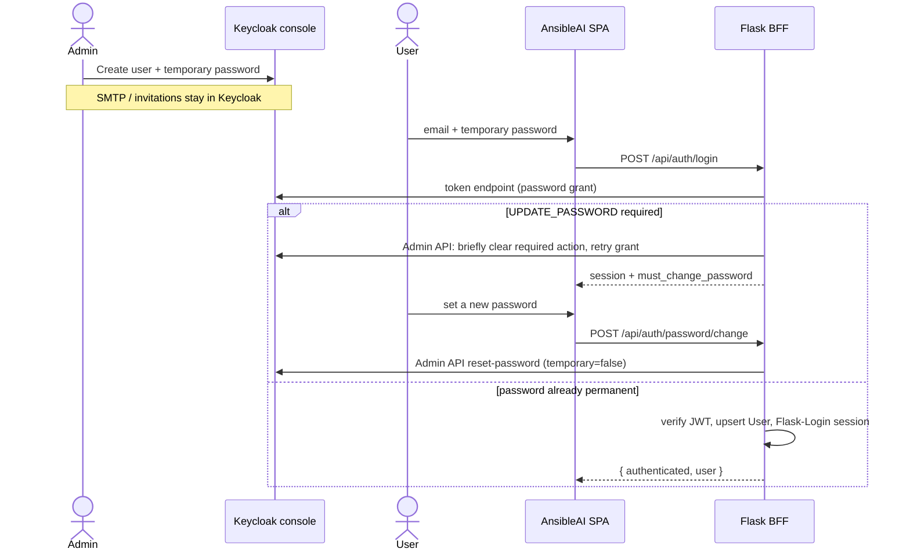

# Feature: Phase 5b — In-app login, Keycloak-only admins, member account

Members never leave AnsibleAI. Keycloak is the identity store and the
**only** admin console (create users, set a temporary password, SMTP).
AnsibleAI has no invite screen and no in-app admin chrome when Keycloak
is the IdP.

## Requirements (EARS)

- While `AUTH_MODE=local`, when a user signs in with email and password, the system shall behave exactly as Phase 0 (no Keycloak required). Knowledge-base admin controls remain visible to `role=admin`.
- While `AUTH_MODE=hybrid` or `oidc` and Keycloak is configured, when a member submits email and password on the AnsibleAI login page, the API shall authenticate against Keycloak’s token endpoint (`grant_type=password`) and establish the existing Flask-Login session. The browser shall not be redirected to Keycloak.
- While the address is listed in `AUTH_BREAK_GLASS_EMAILS`, when that user signs in, the system shall verify the local argon2id hash even if Keycloak is down.
- While Keycloak is the identity store, when a visitor opens the login page, the system shall not offer self-registration or a “Sign in with SSO” redirect. Copy shall tell them to wait for an administrator invitation.
- While an administrator creates a person, they shall do it only in the Keycloak console (Add user → credentials → **temporary** password). AnsibleAI shall not expose `POST /api/admin/users`.
- While Keycloak marks the password temporary (`UPDATE_PASSWORD` required action), when the member signs in on AnsibleAI with that password, the system shall establish a session that can only change the password or sign out, then require a new password **inside AnsibleAI**.
- While a member is signed in, when they open Account, the system shall show identity, today’s token spend, conversation activity, and in-app password change. Langfuse stays operator-only.
- While `AUTH_MODE` is `hybrid` or `oidc`, the SPA shall hide knowledge-base mutation controls. Identity administrators stay in Keycloak; they do not receive AnsibleAI admin UI.
- While `OIDC_BROWSER_REDIRECT=true` (escape hatch), when the SPA loads auth config, the system may advertise `/api/auth/oidc/login`. Default is false.

## Architecture

### [Frontend]

- Single login card: email + password. No Keycloak redirect control.
- Invite-only copy when registration is closed.
- Forced password-change screen when `must_change_password` is true (sign out still allowed).
- Account overlay: Profile, Tokens spent, Activity (threads), Password.
- Knowledge-base scrape/restore hidden unless `app_admin_ui` (local mode only).
- Loading/error: same auth alerts as Phase 0; 503 when the IdP is unreachable.

### [Backend]

- `POST /api/auth/login` — Keycloak Resource Owner Password Credentials when `oidc_enabled`; local hash otherwise / break-glass.
- `GET /api/auth/config` — `oidc_login_url` is null unless browser redirect is explicitly enabled; `registration_enabled` is false in hybrid/oidc; `app_admin_ui` is true only in local mode.
- `GET /api/auth/profile` — identity + token snapshot + thread count. No Langfuse URL or user-id copy.
- `POST /api/auth/password/change` — Keycloak Admin API reset-password after verifying the current password via password grant (or local argon2id in `AUTH_MODE=local`).
- Authorization-code + PKCE endpoints remain but are not linked from the UI.

### [Security]

- SPA never sees the client secret or Keycloak admin password.
- Uniform 401 for bad Keycloak credentials (no account enumeration).
- Login rate limit and Keycloak brute-force both apply.
- CSRF on cookie-authenticated writes unchanged.
- A `must_change_password` session can only hit profile/me, password change, logout, CSRF, and the SPA shell.
- Keycloak groups are **not** mapped to AnsibleAI `role=admin` by default (`OIDC_MAP_APP_ADMIN=false`). Identity admins live in Keycloak.

## Auth modes (5b)

| `AUTH_MODE` | Login UI | Identity | Registration | App admin UI |
|-------------|----------|----------|--------------|--------------|
| `local` | email/password (local hash) | AnsibleAI | existing policy | yes (`role=admin`) |
| `hybrid` / `oidc` (Keycloak up) | email/password (ROPC) | Keycloak | invite-only (Keycloak) | hidden |
| `oidc` without Keycloak configured | break-glass only | local hash | disabled | n/a (process should not start) |

## ADR-001: Password grant (ROPC) instead of browser redirect

### Status
Accepted

### Context
Members must see one AnsibleAI login page. Redirecting to Keycloak’s theme
breaks that requirement. Authorization Code + PKCE is the OAuth 2.1 default
and was implemented in Phase 5.

### Decision
The BFF uses Keycloak Direct Access Grants (`grant_type=password`) with the
confidential client. The SPA posts credentials only to AnsibleAI.

### Alternatives considered
- **Authorization code + PKCE (Phase 5)** — correct OAuth, but the browser leaves AnsibleAI.
- **Keycloak account console / theme branding** — still a Keycloak URL; admins-only console is the intended split.
- **Device / CIBA** — no password field on our page; worse UX here.

### Consequences
- Positive: one login page; existing Flask-Login session; Keycloak remains source of truth.
- Negative: ROPC is discouraged by OAuth 2.1; MFA and social IdPs do not fit this grant. Revisit if those are required.
- Neutral: first login after an invite uses a Keycloak **temporary** password typed on AnsibleAI, then an in-app change. No Keycloak page for members.

## ADR-002: Admins stay in Keycloak; members stay in AnsibleAI

### Status
Accepted

### Context
Identity work (invitations, user create, SMTP, disable accounts) already
exists in Keycloak. Duplicating it in AnsibleAI would add an admin UI the
operators said they will not use.

### Decision
- No AnsibleAI invite API or Team screen.
- Hide docs rescrape/restore in the SPA when `AUTH_MODE` is hybrid/oidc.
- Do not auto-promote Keycloak `ansibleai-admins` to `users.role=admin`.

### Alternatives considered
- **In-app invite API** — convenience for admins who already use Keycloak.
- **Keep KB admin in the SPA for Keycloak admins** — contradicts “admins will not have an AnsibleAI UI”.

### Consequences
- Positive: one admin tool; members never see operator chrome.
- Negative: knowledge-base refresh in hybrid/oidc is an ops procedure (scripts / local mode / API with a local admin), not a button in the member app.

## ADR-003: Temporary password, then in-app change

### Status
Accepted

### Context
Keycloak execute-actions email opens a Keycloak page. The product forbids
that for members. Admins will set a temporary password in the console
instead.

### Decision
ROPC fails with “Account is not fully set up” while `UPDATE_PASSWORD` is
required. The BFF uses the Admin API to briefly clear that action, retry
the grant, restore the action until the member changes the password in
AnsibleAI, and then set a permanent password via Admin API.

### Alternatives considered
- **Execute-actions email** — one Keycloak page; rejected.
- **Custom invite token in AnsibleAI** — more code and a second email stack.

### Consequences
- Positive: members never see Keycloak.
- Negative: Admin API credentials must be available to the API process
  (service account on `ansibleai-web`, or `KEYCLOAK_ADMIN` / `KEYCLOAK_ADMIN_PASSWORD`).
- Negative: other required actions (OTP) still cannot complete on this page.

## Risks

| Risk | Mitigation |
|------|------------|
| Keycloak down | Break-glass local passwords; login returns 503 `idp_unavailable`. |
| Admin API missing roles | Permanent-password users can still sign in; temp-password and in-app change return 503 with `idp_admin_unavailable`. |
| Password grant abuse | Rate limit + Keycloak brute-force + generic errors. |
| Admin API credentials in API env | Same secret store as `OIDC_CLIENT_SECRET`; never sent to the SPA. |
| MFA later | ROPC cannot complete it; would need a browser flow or a different grant. |
